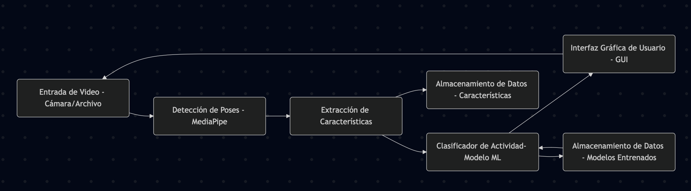
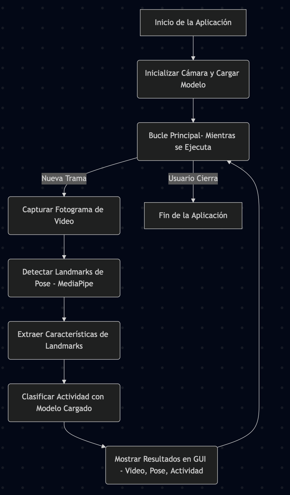
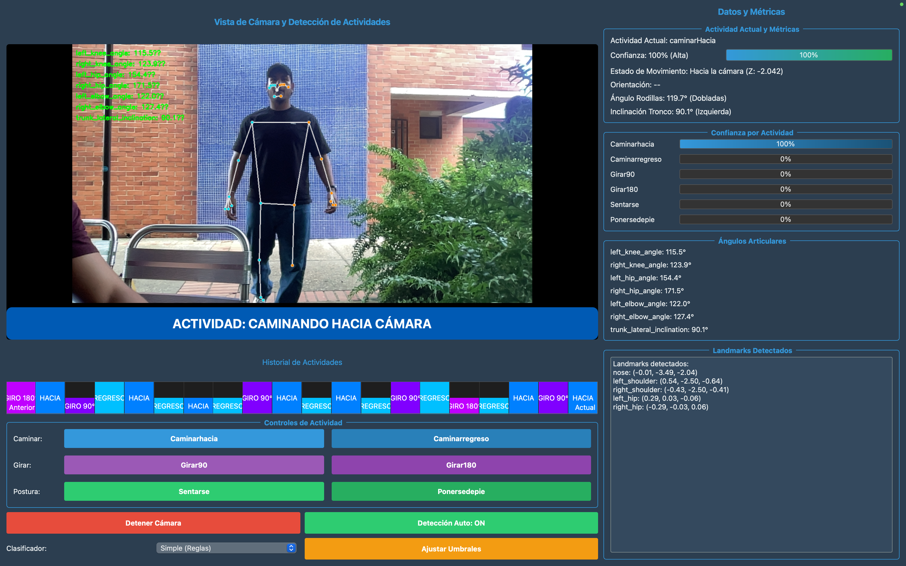
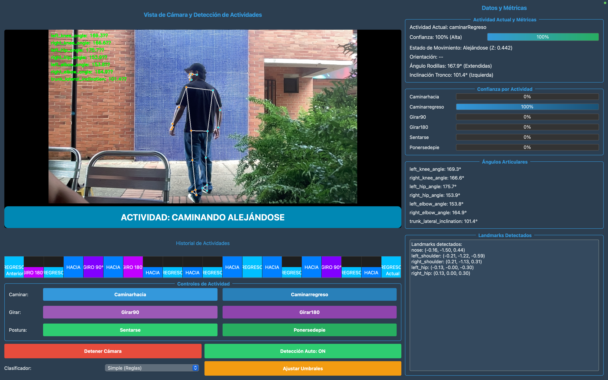
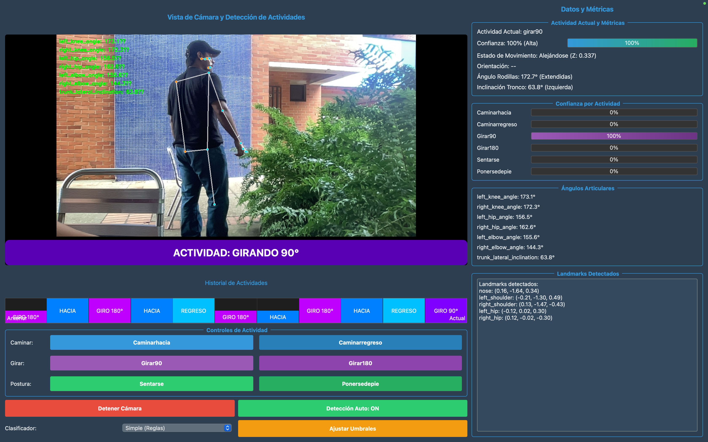
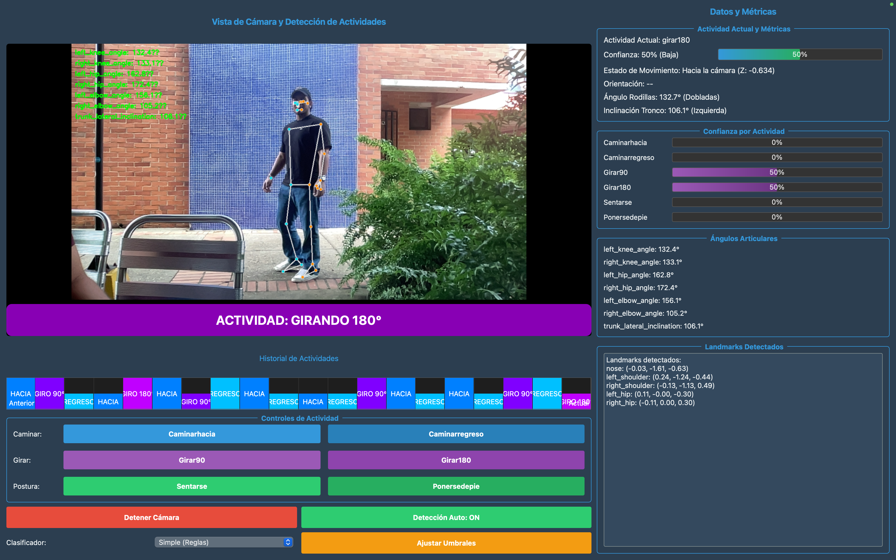
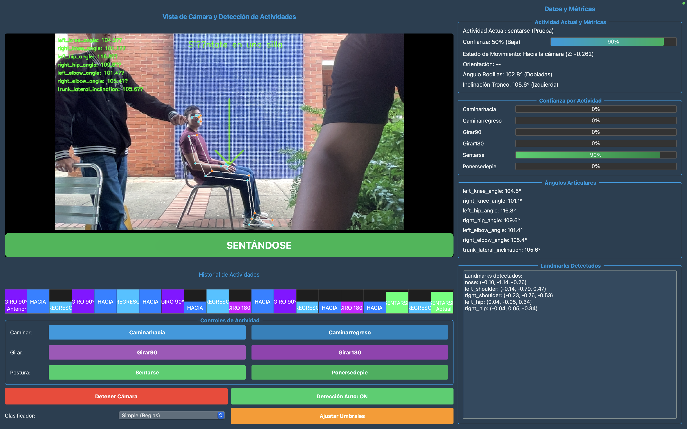
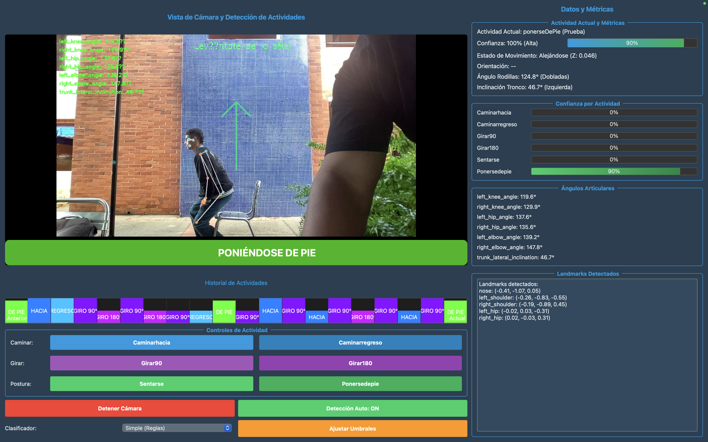

# Sistema de Anotación de Video

## 👥 Integrantes

* [Jhonatan Castaño](https://github.com/JhonatanCI)
* [Andrés Pino](https://github.com/AndresPin0)

**Proyecto Final - Inteligencia Artificial 1**

Un sistema completo para la detección y clasificación de actividades humanas en tiempo real utilizando MediaPipe y técnicas de aprendizaje automático.

## 🎬 Presentación en vídeo

[](https://youtu.be/2BeW1TyJGks)

## 📋 Descripción del Proyecto

Este sistema permite analizar videos en tiempo real para detectar y clasificar las siguientes actividades:

- **Caminar hacia la cámara**: Persona se acerca frontalmente
- **Caminar alejándose**: Persona se aleja de espaldas
- **Girar 90 grados**: Un cuarto de vuelta a la izquierda o derecha
- **Girar 180 grados**: Media vuelta completa
- **Sentarse**: Desde de pie a sentado en silla
- **Ponerse de pie**: Desde sentado a de pie

### Características Principales

- **Detección de poses en tiempo real** usando MediaPipe
- **Clasificación de actividades** con múltiples algoritmos de ML
- **Análisis de inclinaciones laterales** y movimientos articulares
- **Interfaz gráfica intuitiva** para visualización en tiempo real
- **Pipeline completo** desde extracción hasta entrenamiento
- **Análisis exploratorio** de datos con visualizaciones

## 🏗️ Arquitectura del Sistema

```
sistema_anotacion_video/
├── src/                          # Código fuente principal del sistema en tiempo real y módulos centrales
│   ├── __init__.py              # Inicializador del paquete src
│   ├── main.py                  # Punto de entrada para la aplicación GUI en tiempo real
│   ├── pose_detection/          # Módulo para la detección de poses con MediaPipe
│   ├── activity_classifier/     # Módulo para la clasificación de actividades
│   ├── gui/                     # Módulo para la interfaz gráfica de usuario (PyQt5)
│   ├── video_capture/          # Módulo para la captura y manejo de video
│   ├── utils/                   # Utilidades generales y funciones auxiliares
│   ├── data_analysis/           # (Posiblemente) Módulos auxiliares para análisis de datos
│   ├── extract_features/        # (Posiblemente) Módulos auxiliares para extracción de características
│   └── train_classifier/        # (Posiblemente) Módulos auxiliares para entrenamiento de clasificadores
├── docs/                         # Documentación, incluyendo imágenes, diagramas y reporte en pdf
│   └── diagramas/               # Diagramas del sistema (bloques, flujo)
├── videos/                       # Videos de entrada para entrenamiento, organizados por actividad
├── data/                         # Datos procesados (e.g., características extraídas en CSV)
├── models/                       # Modelos de Machine Learning entrenados y su evaluación
│   └── evaluation/              # Reportes de evaluación, comparativas de modelos
│   └── plots/                   # Gráficos de evaluación de modelos
├── analysis/                     # Resultados del análisis exploratorio de datos
│   ├── reports/                 # Reportes de análisis (e.g., analysis_report.txt)
│   ├── plots/                   # Gráficos y visualizaciones del análisis
│   └── statistics/              # Estadísticas detalladas de los datos
├── reports/                      # (Propósito a confirmar, podría ser para reportes generales o logs)
├── extract_video_features.py   # Script para extraer características de los videos
├── train_classifier.py         # Script para entrenar los modelos de clasificación
├── generate_report_plots.py    # Script para generar análisis exploratorio y visualizaciones (antes data_analysis.py)
├── run_pipeline.py             # Script para ejecutar el pipeline completo (extracción, entrenamiento, evaluación)
├── requirements.txt            # Dependencias del proyecto Python
├── README.md                     # Este archivo, con la descripción general del proyecto
└── .gitignore                    # Especifica archivos y directorios ignorados por Git
```

## 🧱 Diagrama de Bloques del Sistema



## ⚙️ Diagrama de Flujo: Pipeline de Entrenamiento


## 👁️ Diagrama de Flujo: Detección de Actividad en Tiempo Real



## 🚀 Instalación y Configuración

### Prerequisitos

- Python 3.8 o superior
- Cámara web funcional
- Sistema operativo: Windows, macOS, o Linux

### Instalación

1. **Clonar el repositorio**:
```bash
git clone https://github.com/AndresPin0/sistema_anotacion_video.git
cd sistema_anotacion_video
```

2. **Crear entorno virtual** (recomendado):
```bash
python -m venv venv
source venv/bin/activate  # En Windows: venv\Scripts\activate
```

3. **Instalar dependencias**:
```bash
pip install -r requirements.txt
```

4. **Verificar instalación**:
```bash
python src/main.py
```

## 📹 Preparación de Datos

### Estructura de Videos

Los videos de entrenamiento deben organizarse en la siguiente estructura:

```
videos/
├── caminar_hacia/
│   ├── video1.mp4
│   ├── video2.mp4
│   └── video3.mp4
├── caminar_regreso/
│   ├── video1.mp4
│   ├── video2.mp4
│   └── video3.mp4
├── girar_90/
│   ├── video1.mp4
│   ├── video2.mp4
│   └── video3.mp4
├── girar_180/
│   ├── video1.mp4
│   ├── video2.mp4
│   └── video3.mp4
├── sentarse/
│   ├── video1.mp4
│   ├── video2.mp4
│   └── video3.mp4
└── ponerse_de_pie/
│   ├── video1.mp4
│   ├── video2.mp4
│   └── video3.mp4
```

### Recomendaciones para Grabación

✅ **Hacer**:
- Persona completa visible en el frame
- Buena iluminación (evitar sombras fuertes)
- Fondo despejado
- Cámara estable
- Duración: 5-15 segundos por video
- Mínimo 3 videos por actividad

❌ **Evitar**:
- Personas parcialmente cortadas
- Iluminación muy pobre
- Movimientos muy rápidos
- Múltiples personas en el frame

## 🔄 Pipeline de Entrenamiento

### Opción 1: Pipeline Automatizado (Recomendado)

Ejecutar todo el proceso de una vez:

```bash
# Pipeline completo
python run_pipeline.py

# Pipeline rápido (sin Grid Search)
python run_pipeline.py --quick_run

# Para pruebas con pocos datos
python run_pipeline.py --max_videos 2 --max_frames 100 --quick_run
```

### Opción 2: Ejecución Manual por Pasos

#### Paso 1: Extracción de Características
```bash
python extract_video_features.py
```

#### Paso 2: Análisis Exploratorio
```bash
python generate_report_plots.py
```

#### Paso 3: Entrenamiento de Modelos
```bash
python train_classifier.py
```

## 🎯 Uso del Sistema

### Aplicación Principal

Ejecutar la interfaz gráfica:
```bash
python src/main.py
```

### Funcionalidades de la GUI

- **Vista en tiempo real** de la cámara con detección de poses
- **Clasificación automática** de actividades
- **Visualización de ángulos articulares** y inclinaciones
- **Ajuste de umbrales** de detección en tiempo real
- **Historial de actividades** detectadas
- **Pistas visuales** para guiar al usuario

## 📷 Capturas del Programa

Aquí se muestran algunas capturas de pantalla del sistema en funcionamiento:

**Caminando hacia la cámara:**


**Caminando alejándose de la cámara:**


**Girar 90 grados:**


**Girar 180 grados:**


**Sentándose:**


**Poniéndose de pie:**


## 📊 Análisis y Resultados

### Ubicación de los Resultados Detallados
Los resultados detallados del análisis y la evaluación de modelos se pueden encontrar en los siguientes archivos:
- **Análisis Exploratorio**:
    - Reporte completo: `analysis/reports/analysis_report.json`
    - Visualizaciones y gráficos: `analysis/plots/`
    - Estadísticas detalladas: `analysis/statistics/`
- **Evaluación de Modelos**:
    - Comparación de modelos: `models/evaluation/model_comparison.csv`
    - Información del mejor modelo: `models/evaluation/best_model_info.json`
    - Gráficos de evaluación: `models/plots/`

### Resumen del Análisis Exploratorio de Datos
(Basado en `analysis/reports/analysis_report.json`)

- **Información General del Dataset**:
    - Fecha del análisis: 2025-06-04
    - Total de muestras: 1849
    - Total de características analizadas: 101
    - Actividades: `caminarHacia`, `caminarRegreso`, `girar180`, `girar90`, `ponerseDePie`, `sentarse`.
- **Distribución de Muestras por Actividad**:
    - `girar180`: 369 muestras
    - `girar90`: 369 muestras
    - `caminarHacia`: 355 muestras
    - `ponerseDePie`: 267 muestras
    - `sentarse`: 250 muestras
    - `caminarRegreso`: 239 muestras
- El reporte completo (`analysis_report.json`) contiene estadísticas descriptivas detalladas (media, desviación estándar, etc.) para cada característica, desglosadas por actividad.

### Resumen de Evaluación de Modelos
(Basado en `models/evaluation/model_comparison.csv` y `models/evaluation/best_model_info.json`)

Se evaluaron varios modelos de Machine Learning. La siguiente tabla resume su rendimiento:

| Modelo             | Accuracy | Precision | Recall   | F1-Score |
| :----------------- | :------- | :-------- | :------- | :------- |
| RandomForest       | 0.6541   | 0.6563    | 0.6541   | 0.6551   |
| SVM                | 0.6649   | 0.6599    | 0.6649   | 0.6603   |
| **LogisticRegression** | **0.6946** | **0.6930**  | **0.6946** | **0.6933** |
| GradientBoosting   | 0.6757   | 0.6757    | 0.6757   | 0.6757   |
| KNN                | 0.6649   | 0.6564    | 0.6649   | 0.6598   |
| XGBoost            | 0.6703   | 0.6705    | 0.6703   | 0.6703   |

- **Mejor Modelo**: `LogisticRegression`
    - Accuracy: ~69.46%
    - Precision: ~69.30%
    - Recall: ~69.46%
    - F1-Score: ~69.33%

Estos resultados indican que el modelo de Regresión Logística ofreció el mejor rendimiento general para la clasificación de las actividades definidas.

### Métricas Principales

El sistema evalúa los modelos usando:
- **Accuracy**: Precisión general
- **Precision**: Precisión por clase
- **Recall**: Sensibilidad por clase
- **F1-Score**: Media armónica de precisión y recall

## 🔧 Configuración Avanzada

### Modelos Disponibles

El sistema entrena múltiples algoritmos:
- **Random Forest**: Robusto y rápido
- **SVM**: Efectivo para datos de alta dimensión
- **Logistic Regression**: Simple y interpretable
- **Gradient Boosting**: Potente para patrones complejos
- **K-Nearest Neighbors**: Bueno para decisiones locales
- **XGBoost**: Opcional, requiere instalación adicional

### Personalización de Parámetros

Puedes ajustar parámetros en los scripts:

```bash
# Seleccionar número de características
python train_classifier.py --n_features 30

# Cambiar validation folds
python train_classifier.py --cv_folds 3

# Usar archivo específico de datos
python train_classifier.py --data_file mi_dataset.csv
```

## 📈 Metodología CRISP-DM

El proyecto sigue la metodología CRISP-DM:

1. **Comprensión del Negocio**: Detección de actividades humanas
2. **Comprensión de Datos**: Análisis de videos y landmarks
3. **Preparación de Datos**: Extracción y normalización de características
4. **Modelado**: Entrenamiento de múltiples algoritmos
5. **Evaluación**: Métricas de rendimiento y validación cruzada
6. **Despliegue**: Aplicación en tiempo real

## 🤖 Aspectos Técnicos

### Detección de Poses

- **MediaPipe Pose**: Detección de 33 landmarks corporales
- **Normalización**: Coordenadas relativas al centro de cadera
- **Filtrado**: Suavizado de landmarks para reducir ruido

### Extracción de Características

- **Coordenadas de landmarks**: x, y, z normalizadas
- **Ángulos articulares**: Rodillas, caderas, codos
- **Características geométricas**: Distancias y proporciones
- **Características temporales**: Velocidades y aceleraciones

### Clasificación

- **Enfoque híbrido**: Reglas + Machine Learning
- **Características seleccionadas**: Top N más relevantes
- **Validación cruzada**: Evaluación robusta
- **Optimización**: Grid Search para hiperparámetros

## 🔍 Resolución de Problemas

### Problemas Comunes

1. **Error de cámara**:
   - Verificar que la cámara no esté en uso
   - Probar con diferentes índices de cámara

2. **Baja precisión**:
   - Agregar más videos de entrenamiento
   - Mejorar calidad de iluminación
   - Ajustar umbrales de detección

3. **Rendimiento lento**:
   - Reducir resolución de video
   - Usar modo rápido (--quick_run)
   - Cerrar otras aplicaciones

### Logs y Depuración

- Los logs se muestran en consola durante la ejecución
- Los errores se guardan en archivos de salida
- Usar `--verbose` para más información detallada

### Estructura de Código

- **Documentación**: Docstrings en todas las funciones
- **Estilo**: Seguir PEP 8
- **Testing**: Agregar tests para nuevas funcionalidades

## 📚 Referencias y Bibliografia

### Tecnologías Utilizadas

- [MediaPipe](https://ai.google.dev/edge/mediapipe/solutions/guide) - Detección de poses
- [OpenCV](https://opencv.org/) - Procesamiento de video
- [scikit-learn](https://scikit-learn.org/) - Machine Learning
- [PyQt5](https://pypi.org/project/PyQt5/) - Interfaz gráfica

### Artículos de Referencia

- Pose Detection and Activity Recognition using MediaPipe
- Human Activity Recognition: A Comprehensive Survey
- Real-time Activity Classification in Video Streams